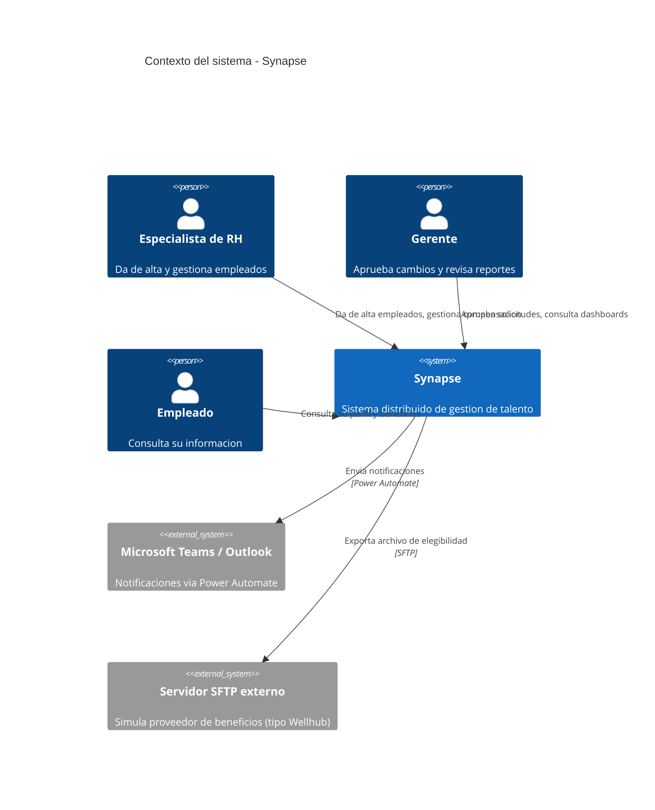
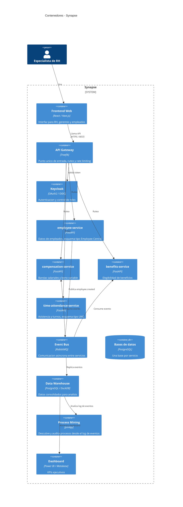

# Arquitectura

## Diagrama de contexto (C4 nivel 1)

Muestra quien usa el sistema y con que sistemas externos habla.

## Diagrama de contenedores (C4 nivel 2)

Muestra las piezas internas del sistema y como se comunican.

## Notas de diseno

- Cada microservicio tiene su propia base de datos (database per service). No comparten tablas entre si, solo se comunican por eventos o por API.
- El esquema de `employee-service` sigue la estructura publica del OData API de SAP SuccessFactors Employee Central (entidades, foundation objects). No usa ninguna configuracion real de un cliente.
- El esquema de `time-attendance-service` sigue la estructura publica de las APIs de UKG Pro / UKG Ready para asistencia y turnos.
- El bus de eventos es la columna vertebral: cuando `employee-service` publica `employee.created`, los demas servicios reaccionan de forma independiente. Esto evita llamadas sincronas directas entre servicios.
- El log completo de eventos alimenta el modulo de process mining, que descubre el proceso real (no el documentado) y detecta cuellos de botella.

Estos diagramas se actualizan conforme avanza cada fase.
